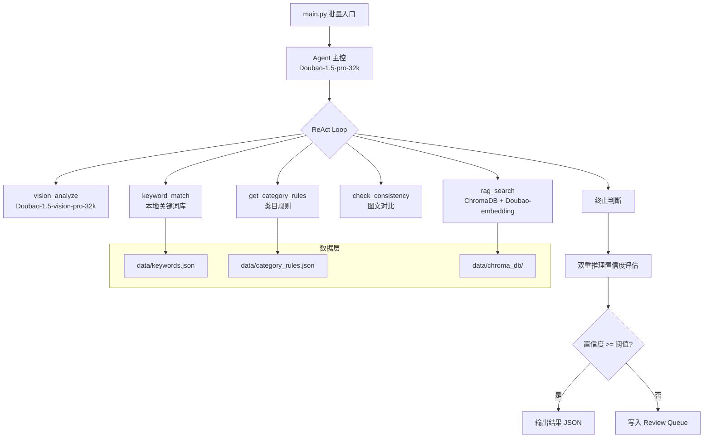
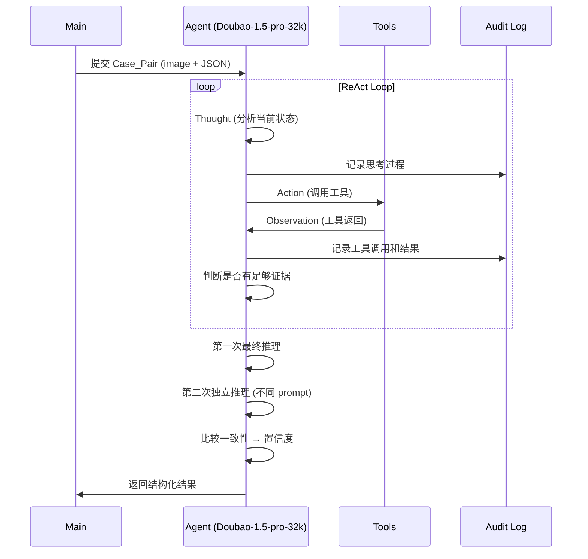
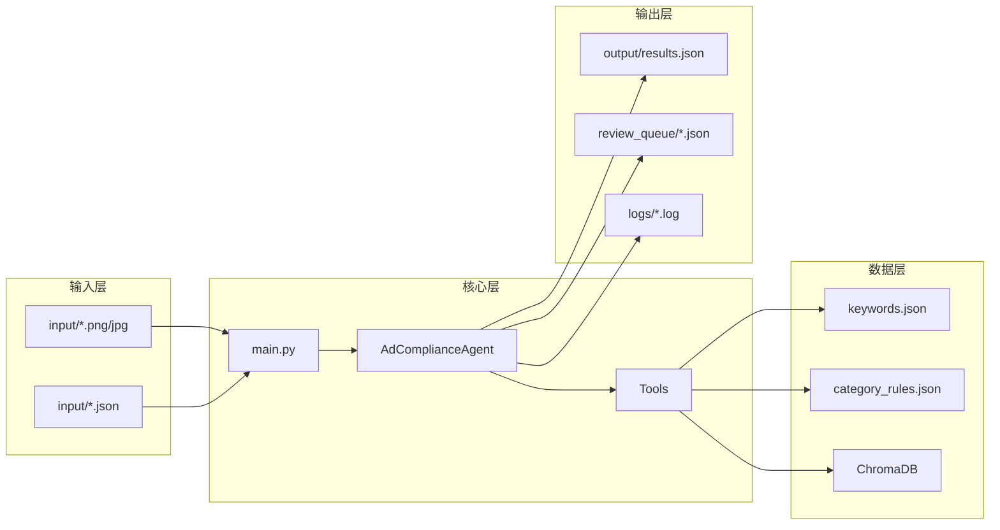

# Design Document: Ad Compliance Review Agent

## Overview

本系统是一个基于 ReAct 架构的广告合规审查智能体，使用 LangGraph 实现自主推理循环。系统接收广告图片与商品结构化数据（Case_Pair），通过多模态视觉模型提取文字和视觉线索，结合关键词检测、RAG 法条检索、图文一致性校验和类目规则查询等工具，自主推理并输出违规判定、法规依据及处理建议。

核心设计决策：
- **ReAct 而非 Pipeline**：Agent 自主决定工具调用顺序，而非固定流水线，提供更灵活的推理能力
- **双重推理置信度**：对同一证据做两次独立推理，通过一致性校验得出置信度
- **多模态一体化**：视觉模型同时完成 OCR 和视觉违规判断，无需独立 OCR 服务
- **RAG 法条引用**：所有违规判定必须引用具体法律条款，确保结论有法律依据

## Architecture

### 系统架构图



### ReAct 循环流程



### 技术栈

| 组件 | 技术选型 | 用途 |
|------|----------|------|
| Agent 框架 | LangGraph | ReAct 循环实现 |
| 主控模型 | Doubao-1.5-pro-32k | 推理 + 工具调用 |
| 视觉模型 | Doubao-1.5-vision-pro-32k | OCR + 视觉违规检测 |
| Embedding | Doubao-embedding | 法条向量化 |
| 向量库 | ChromaDB | 本地持久化向量存储 |
| API 兼容 | OpenAI SDK | 火山方舟兼容格式 |

## Components and Interfaces

### 1. Agent 主控 (`src/agent.py`)

LangGraph ReAct Agent 的核心实现，负责推理循环和工具调度。

```python
class AdComplianceAgent:
    """广告合规审查 Agent 主控"""
    
    def review_case(self, case: CasePair) -> ReviewResult:
        """审查单个 Case_Pair，返回结构化结果"""
        ...
    
    def review_batch(self, input_dir: str) -> list[ReviewResult]:
        """批量审查 input_dir 中的所有 Case_Pairs"""
        ...
```

### 2. 工具集 (`src/tools/`)

#### vision.py - 多模态视觉分析
```python
def vision_analyze(image_path: str) -> VisionResult:
    """
    调用 Doubao-1.5-vision-pro-32k 分析广告图片。
    返回: 提取文字 + 视觉违规线索列表
    """
```

#### keywords.py - 关键词检测
```python
def keyword_match(text: str) -> list[KeywordHit]:
    """
    匹配文本中的违规关键词。
    返回: 命中关键词列表，每项包含关键词、违规类型、上下文
    """
```

#### rag.py - RAG 法条检索
```python
def rag_search(query: str, top_k: int = 3) -> list[LawArticle]:
    """
    从 ChromaDB 检索相关法条。
    返回: 相关法条列表，包含法规名、条款号、原文
    """
```

#### consistency.py - 图文一致性校验
```python
def check_consistency(extracted_text: str, product_json: dict) -> list[Contradiction]:
    """
    对比图片提取文字与商品 JSON 数据。
    返回: 矛盾点列表，每项包含图片文案段、JSON 字段、矛盾描述
    """
```

#### category.py - 类目规则查询
```python
def get_category_rules(category: str) -> CategoryRuleSet:
    """
    根据商品类目返回加严规则。
    返回: 该类目的审查规则集
    """
```

### 3. RAG 构建脚本 (`scripts/build_rag.py`)

```python
def build_rag(doc_paths: list[str], db_path: str = "data/chroma_db/"):
    """
    读取法条 docx 文件，按"第X条"切分，向量化后存入 ChromaDB。
    支持多个法条文件。
    """
```

### 4. 人工复核回读脚本 (`scripts/review_reader.py`)

```python
def read_review_decisions(review_dir: str = "review_queue/"):
    """
    读取 review_queue/ 中已填写 human_decision 的 JSON 文件，
    汇总复核结果。
    """
```

### 5. 批量运行入口 (`main.py`)

```python
def main():
    """
    1. 验证 input/ 目录中的 Case_Pairs
    2. 检查批量大小限制 (<=10)
    3. 逐个调用 Agent 审查
    4. 输出结果到 output/
    5. 低置信度案例写入 review_queue/
    """
```

### 组件交互关系



## Data Models

### CasePair - 审查案例输入

```python
@dataclass
class CasePair:
    case_id: str              # 案例唯一标识（文件名 stem）
    image_path: str           # 广告图片路径
    json_path: str            # 商品 JSON 路径
    product_data: dict        # 解析后的商品数据
```

### Product_JSON 结构（输入）

```json
{
  "user_id": "string",
  "title": "商品标题",
  "category": "商品类目",
  "price": "价格",
  "original_price": "原价（可选）",
  "efficacy_claims": ["功效声明列表"],
  "specifications": "规格",
  "origin": "产地",
  "certifications": ["资质列表"]
}
```

### VisionResult - 视觉分析结果

```python
@dataclass
class VisionResult:
    extracted_text: str                    # 提取的全部文字
    visual_indicators: list[VisualIndicator]  # 视觉违规线索

@dataclass
class VisualIndicator:
    indicator_type: str   # 类型：exaggerated_comparison, fake_stamp, misleading_chart
    description: str      # 描述
    confidence: float     # 模型对该线索的置信度
```

### KeywordHit - 关键词命中

```python
@dataclass
class KeywordHit:
    keyword: str           # 命中的关键词
    violation_type: str    # 对应违规类型
    context: str           # 关键词所在上下文
    position: int          # 在文本中的位置
```

### LawArticle - 法条

```python
@dataclass
class LawArticle:
    law_name: str          # 法规名称
    chapter: str           # 章节
    article_number: str    # 条款号
    content: str           # 条款原文
    relevance_score: float # 相关度分数
```

### Contradiction - 矛盾点

```python
@dataclass
class Contradiction:
    image_text_segment: str   # 图片中的文案段
    json_field: str           # 矛盾的 JSON 字段名
    json_value: str           # JSON 字段值
    description: str          # 矛盾描述
```

### CategoryRuleSet - 类目规则集

```python
@dataclass
class CategoryRuleSet:
    category: str                    # 类目名称
    prohibited_claims: list[str]     # 禁止声明
    required_disclaimers: list[str]  # 必须包含的免责声明
    extra_keywords: list[str]        # 额外敏感关键词
    severity_boost: bool             # 是否提升违规严重度
```

### ReviewResult - 审查结果（输出）

```python
@dataclass
class ReviewResult:
    case_id: str                      # 案例 ID
    user_id: str                      # 用户 ID
    violation_types: list[str]        # 违规类型列表
    reasoning: str                    # 推理过程
    legal_references: list[str]       # 法条引用列表
    confidence_score: float           # 置信度 (0.0-1.0)
    recommended_action: str           # 建议处理：下架/限流/标注/通过
    image_path: str                   # 图片路径
    json_path: str                    # JSON 路径
```

### ReviewQueueItem - 人工复核队列项

```python
@dataclass
class ReviewQueueItem:
    case_id: str
    user_id: str
    violation_types: list[str]
    reasoning: str
    legal_references: list[str]
    confidence_score: float
    recommended_action: str
    image_path: str
    json_path: str
    human_decision: str | None        # 初始为 null，复核员填写
    review_notes: str | None          # 复核备注
```

### AuditLogEntry - 审计日志条目

```python
@dataclass
class AuditLogEntry:
    timestamp: str          # ISO 格式时间戳
    case_id: str            # 案例 ID
    step_number: int        # 步骤序号
    step_type: str          # thought / action / observation / final_judgment
    tool_name: str | None   # 工具名（action 时）
    tool_input: dict | None # 工具输入
    tool_output: str | None # 工具输出
    content: str            # 思考内容或判断内容
```

### keywords.json 结构

```json
{
  "keywords": [
    {
      "keyword": "全网最低价",
      "violation_type": "绝对化用语",
      "severity": "high"
    },
    {
      "keyword": "根治",
      "violation_type": "医疗暗示",
      "severity": "high"
    }
  ]
}
```

### category_rules.json 结构

```json
{
  "医疗器械": {
    "prohibited_claims": ["治愈", "根治", "100%有效"],
    "required_disclaimers": ["请遵医嘱"],
    "extra_keywords": ["临床验证", "医学证明"],
    "severity_boost": true
  },
  "保健食品": {
    "prohibited_claims": ["治疗", "替代药物"],
    "required_disclaimers": ["本品不能代替药物"],
    "extra_keywords": ["疗效", "药效"],
    "severity_boost": true
  }
}
```


## Correctness Properties

*A property is a characteristic or behavior that should hold true across all valid executions of a system—essentially, a formal statement about what the system should do. Properties serve as the bridge between human-readable specifications and machine-verifiable correctness guarantees.*

### Property 1: Case_Pair 配对正确性

*For any* directory containing a mix of image files and JSON files, the pairing function shall return exactly those pairs where an image and a JSON share the same filename stem, and shall report all unpaired files (images without JSON or JSON without images) as errors.

**Validates: Requirements 1.1, 1.2, 1.3**

### Property 2: 批量大小限制

*For any* batch of Case_Pairs with size N, the system shall accept the batch if and only if N <= 10. Batches with N > 10 shall be rejected with an error message containing the size limit.

**Validates: Requirements 1.4, 1.5**

### Property 3: 视觉分析结果结构完整性

*For any* raw vision model response that follows the expected format, parsing shall produce a valid VisionResult containing a non-null extracted_text string and a list of VisualIndicator objects each with indicator_type, description, and confidence fields.

**Validates: Requirements 2.3**

### Property 4: 关键词匹配完整性

*For any* text string and keyword library, the keyword_match function shall return a hit for every keyword in the library that appears as a substring in the text, with each hit correctly identifying the violation_type and the context surrounding the keyword.

**Validates: Requirements 3.1, 3.4**

### Property 5: 法条切分正确性（RAG 构建 Round-Trip）

*For any* law document text containing articles delimited by "第X条" patterns, splitting by the regex pattern shall produce articles where each article's content starts after its "第X条" marker, and concatenating all split articles (with their markers) shall reconstruct the original document text.

**Validates: Requirements 4.1**

### Property 6: 法条引用格式合规

*For any* ReviewResult that contains non-empty violation_types, every entry in legal_references shall match the citation format pattern `《.+》第.+条` (e.g., "《广告法》第九条第三项").

**Validates: Requirements 4.3**

### Property 7: 图文矛盾检测结构完整性

*For any* detected contradiction between extracted image text and Product_JSON, the Contradiction output shall specify a non-empty image_text_segment, a valid json_field name that exists in the Product_JSON, and a non-empty description.

**Validates: Requirements 5.2, 5.3**

### Property 8: 类目规则返回正确性

*For any* product category that exists in the Category_Rules configuration, the get_category_rules function shall return a non-empty CategoryRuleSet containing prohibited_claims, required_disclaimers, and extra_keywords lists.

**Validates: Requirements 6.1, 6.3**

### Property 9: 违规类型和处理建议枚举约束

*For any* ReviewResult, every item in violation_types shall be one of {绝对化用语, 虚构承诺, 虚假对比, 医疗暗示, 价格欺诈, 资质伪造}, and recommended_action shall be one of {下架, 限流, 标注, 通过}.

**Validates: Requirements 7.1, 7.2**

### Property 10: 置信度计算一致性

*For any* pair of independent judgments on the same evidence, the confidence calculation function shall produce a score in [0.0, 1.0] where agreeing judgments yield a score above the configurable threshold and disagreeing judgments yield a score below the threshold.

**Validates: Requirements 8.3, 8.4, 8.5**

### Property 11: 低置信度案例路由到复核队列

*For any* ReviewResult with confidence_score below the configurable threshold, the system shall write a JSON file to review_queue/ containing all ReviewResult fields plus a human_decision field initialized to null.

**Validates: Requirements 9.1, 9.2**

### Property 12: 复核决定回读 Round-Trip

*For any* review queue JSON file where human_decision has been filled in with a non-null string value, the review_reader script shall correctly parse and return that decision along with the associated case_id.

**Validates: Requirements 9.3**

### Property 13: 审计日志完整性

*For any* completed case, the audit log shall contain a sequence of AuditLogEntry objects where: each entry has a valid ISO timestamp, the sequence starts with step_number=1, step numbers are consecutive, and the final entry has step_type="final_judgment".

**Validates: Requirements 10.1, 10.2, 10.4**

### Property 14: 结果 JSON 结构完整性

*For any* ReviewResult serialized to JSON, the output shall be valid JSON containing all required fields (case_id, user_id, violation_types, reasoning, legal_references, confidence_score, recommended_action, image_path, json_path) with non-null values.

**Validates: Requirements 7.3, 12.1, 12.2**

### Property 15: 无违规结果格式

*For any* case where no violation is detected, the ReviewResult shall have an empty violation_types list and recommended_action equal to "通过".

**Validates: Requirements 12.3**

## Error Handling

### 错误分类与处理策略

| 错误类型 | 触发条件 | 处理方式 |
|----------|----------|----------|
| 输入缺失 | Case_Pair 缺少图片或 JSON | 报告缺失文件，跳过该对 |
| 批量超限 | 批量 > 10 个 Case_Pairs | 拒绝整批，返回错误信息 |
| 视觉模型失败 | API 调用超时或返回错误 | 记录错误，标记为人工复核 |
| RAG 检索失败 | ChromaDB 不可用或无结果 | 降级为无法条引用，降低置信度 |
| JSON 解析失败 | Product_JSON 格式错误 | 报告解析错误，跳过该对 |
| 类目未识别 | category 字段缺失或未知 | 使用通用规则，记录日志 |
| API 限流 | 火山方舟 API 返回 429 | 指数退避重试，最多 3 次 |
| 置信度不足 | 双重推理结论不一致 | 写入复核队列 |

### 重试策略

```python
RETRY_CONFIG = {
    "max_retries": 3,
    "base_delay": 1.0,        # 秒
    "exponential_base": 2,    # 指数退避
    "retryable_errors": [429, 500, 502, 503, 504]
}
```

### 降级策略

当某个工具不可用时，Agent 应继续使用其他可用工具进行推理：
- 视觉模型不可用 → 无法提取文字，直接标记人工复核
- RAG 不可用 → 可以做违规判断但无法引用法条，降低置信度
- 关键词库不可用 → 跳过关键词检测，依赖其他工具
- 类目规则不可用 → 使用通用规则

## Testing Strategy

### 测试框架选型

- **单元测试**: pytest
- **Property-Based Testing**: hypothesis (Python PBT 标准库)
- **测试配置**: 每个 property test 最少运行 100 次迭代

### Property-Based Tests

每个 Correctness Property 对应一个 property-based test，使用 hypothesis 库实现。

测试标注格式: `# Feature: ad-compliance-review, Property {number}: {property_text}`

```python
from hypothesis import given, settings, strategies as st

# Feature: ad-compliance-review, Property 1: Case_Pair 配对正确性
@settings(max_examples=100)
@given(file_stems=st.lists(st.text(min_size=1, max_size=20, alphabet=st.characters(whitelist_categories=('L', 'N'))), min_size=0, max_size=15))
def test_case_pair_matching(file_stems):
    """For any directory of files, pairing correctly identifies valid pairs and reports unpaired files."""
    ...

# Feature: ad-compliance-review, Property 4: 关键词匹配完整性
@settings(max_examples=100)
@given(text=st.text(min_size=0, max_size=500), keywords=st.lists(st.text(min_size=1, max_size=10), min_size=1, max_size=20))
def test_keyword_match_completeness(text, keywords):
    """For any text and keyword library, all present keywords are detected."""
    ...
```

### Unit Tests

单元测试覆盖具体示例和边界情况：

- **输入验证**: 空目录、单文件、恰好 10 个和 11 个 Case_Pairs
- **关键词匹配**: 已知文本中的已知关键词、无匹配情况、重叠关键词
- **RAG 构建**: 已知法条文档的切分结果验证
- **置信度计算**: 完全一致、完全不一致、部分一致的判断对
- **结果序列化**: 有违规和无违规的 ReviewResult JSON 输出
- **复核队列**: 写入和回读的完整流程
- **审计日志**: 单步骤和多步骤的日志记录

### 集成测试

- 使用 mock 的视觉模型和 RAG 存储，验证 Agent 完整 ReAct 循环
- 验证端到端流程：输入 → Agent 推理 → 输出结果 + 日志
- 验证低置信度案例正确路由到复核队列

### 测试目录结构

```
tests/
├── test_pairing.py          # Property 1, 2
├── test_vision_parsing.py   # Property 3
├── test_keywords.py         # Property 4
├── test_rag_split.py        # Property 5
├── test_citation_format.py  # Property 6
├── test_consistency.py      # Property 7
├── test_category_rules.py   # Property 8
├── test_enum_constraints.py # Property 9
├── test_confidence.py       # Property 10
├── test_review_queue.py     # Property 11, 12
├── test_audit_log.py        # Property 13
├── test_result_output.py    # Property 14, 15
└── test_integration.py      # 集成测试
```
